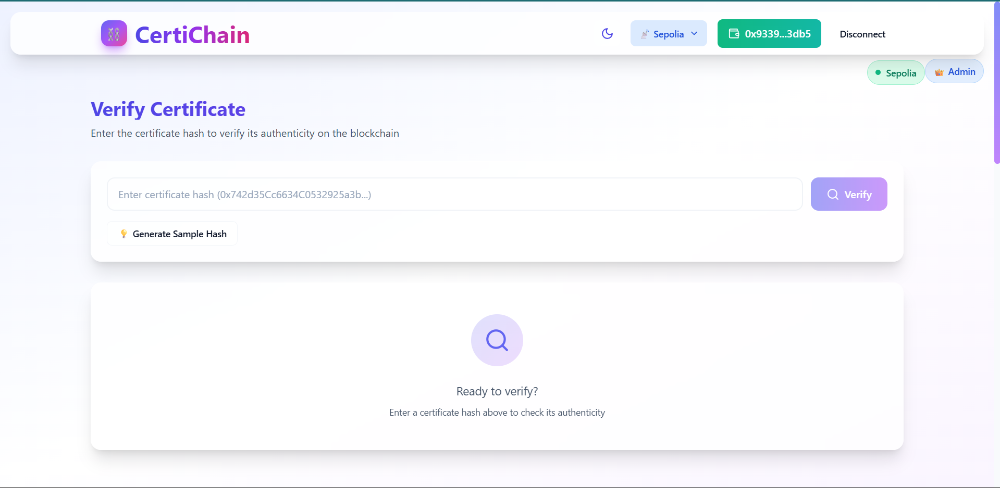
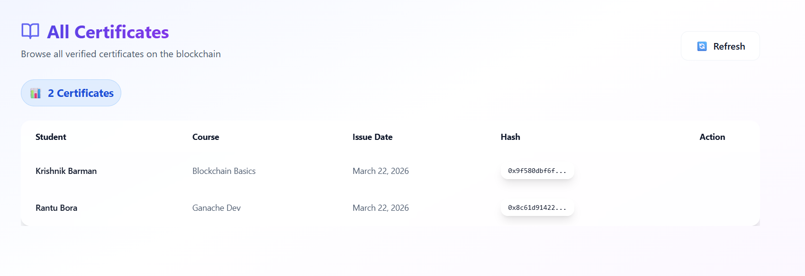
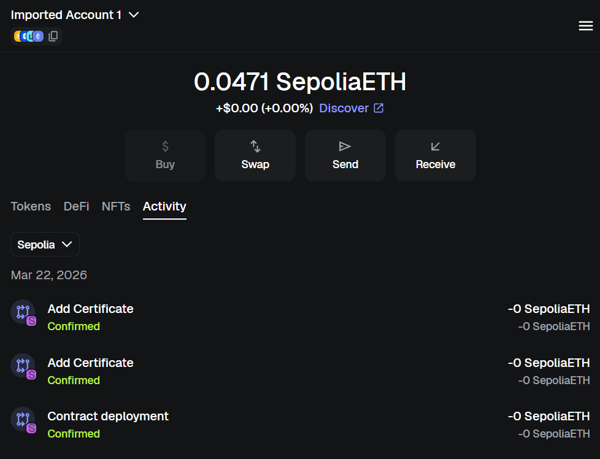

# 🚀 CertiChain – Blockchain Certificate Verification System

A decentralized certificate verification platform built using **React, Ethers.js, and Ethereum (Sepolia Testnet)**.
CertiChain ensures **tamper-proof, verifiable, and transparent certificate validation** using blockchain technology.

---

## ✨ Key Features

### 🔐 Blockchain Security

* Immutable certificate storage on Ethereum
* Smart contract-based verification
* Admin-controlled certificate issuance
* Tamper-proof digital records

### ⚙️ Core Functionality

* ✅ Add certificates (Admin only)
* ✅ Verify certificates using hash
* ✅ View all certificates on-chain
* ✅ QR-based certificate sharing
* ✅ Multi-network support (Ganache + Sepolia)

### 🎨 User Experience

* Modern glassmorphism UI
* Dark / Light mode support
* Responsive design (mobile-friendly)
* Real-time transaction feedback
* Wallet reconnect + network switch support

---

## 🧱 Tech Stack

| Layer      | Technology          |
| ---------- | ------------------- |
| Frontend   | React + Vite        |
| Blockchain | Solidity (Ethereum) |
| Web3       | Ethers.js v6        |
| Styling    | Tailwind CSS        |
| Wallet     | MetaMask            |
| QR Code    | qrcode.react        |

---

## 📸 Screenshots

### 🔗 Wallet Connected (Sepolia)



Shows MetaMask connected with Sepolia testnet and active wallet session.

---

### 🔍 Verify Certificate


Users can verify certificate authenticity using a unique hash stored on blockchain.

---

### ➕ Add Certificate (Admin)


Admin panel for adding new certificates securely to the blockchain.

---

### 📄 All Certificates



Displays all certificates stored on-chain with student and course details.

---

### 🧾 MetaMask Activity



Blockchain transactions including contract deployment and certificate addition.

---

## ⚡ Getting Started

### 1. Clone Repository

```bash
git clone https://github.com/your-username/certichain.git
cd certichain
```

### 2. Install Dependencies

```bash
npm install --legacy-peer-deps
```

### 3. Configure Smart Contract

Update contract address in:

```js
src/utils/contract.js
```

```js
const CONTRACT_ADDRESS = "YOUR_DEPLOYED_CONTRACT_ADDRESS";
```

---

### 4. Run Project

```bash
npm run dev
```

Open:

```
http://localhost:3000
```

---

## 🌐 Network Configuration

Supports:

* 🏠 Ganache (Local)
* 🌍 Sepolia (Testnet)

```js
chainId: '0x539'      // Ganache
chainId: '0xaa36a7'   // Sepolia
```

---

## 🧪 How It Works

### 🔹 Add Certificate (Admin)

1. Connect MetaMask
2. Fill certificate details
3. Approve transaction
4. Data stored on blockchain

---

### 🔹 Verify Certificate

1. Enter certificate hash
2. Click verify
3. View:

   * Student Name
   * Course
   * Issue Date
   * QR Code

---

### 🔹 View All Certificates

* Fetches all stored hashes
* Displays certificate list
* Click to verify details

---

## 📦 Build & Deployment

```bash
npm run build
npm run preview
```

### 🚀 Recommended Deployment

* Vercel (Frontend)
* Sepolia (Smart Contract)

---

## 🛡️ Security Notes

* No private keys stored in frontend
* All transactions require MetaMask approval
* Admin-only functions enforced via smart contract
* Always test on testnet before mainnet

---

## 📌 Future Improvements

* NFT-based certificates
* IPFS document storage
* Certificate revocation system
* Advanced search & filtering
* Multi-admin roles

---

## 👨‍💻 Author

**Krishnik Barman**
🔗 GitHub: https://github.com/krishnikbarman

---

## 📜 License

MIT License
